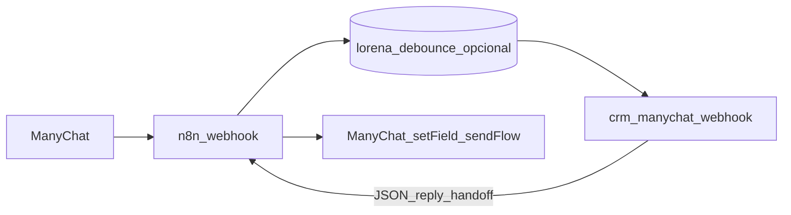
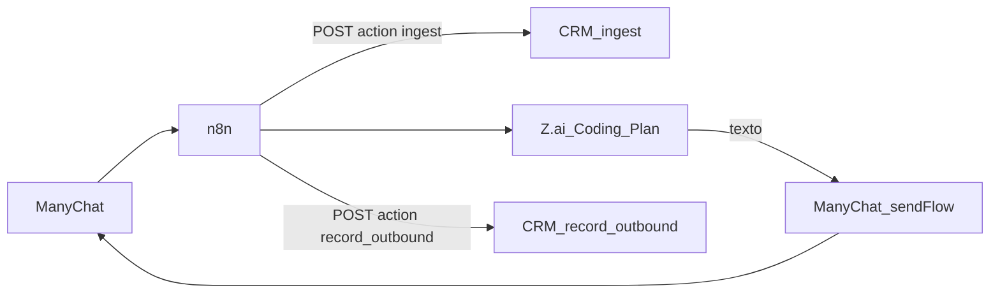

# n8n + CRM: duas formas de operar

> **Directo (simples):** ManyChat → `crm-manychat-webhook` (sem `action` ou `action: message`) → IA no Edge com **Z.ai** + histórico em `interactions`. **Com n8n (orquestração):** ManyChat → n8n (debounce, Z.ai no n8n) → CRM só como **tools HTTP** — ver [n8n-crm-tools.md](n8n-crm-tools.md) (`ingest`, `get_thread`, `record_outbound`, `merge_phone`). Este ficheiro mantém o **mapa nó-a-nó** do export antigo para perceberes o equivalente no CRM.

---

O export [integrations/n8n/workflows/Instituto_Lorena_Visentainer_FIXED.json](../integrations/n8n/workflows/Instituto_Lorena_Visentainer_FIXED.json) fazia:

1. **Webhook** (payload ManyChat: `body.data.id` = subscriber, `body.msg` = texto).
2. **Debounce** em Postgres (`lorena_debounce`) + espera 6s + “sou o último?” — evita disparar a IA a cada tecla.
3. **ManyChat API** `subscriber/getInfo` + código **Montar contexto** (nome, cidade, tags).
4. **AI Agent** (OpenAI `gpt-4o`) + memória `n8n_chat_histories_lorena`.
5. **Detectar intenção** (`[PRONTO_PARA_CONSULTOR]`) → ramos erro / normal / handoff → **setCustomField** + **sendFlow**.

Se **mantiveres o n8n** como cérebro (debounce + modelo Z.ai no n8n), usa o CRM como **persistência e Kanban** via as actions documentadas em [n8n-crm-tools.md](n8n-crm-tools.md). Se **retirares o n8n**, a IA e o histórico ficam no Edge — [manychat-setup.md](manychat-setup.md).

## Mapa workflow FIXED n8n para CRM com Z.ai {#mapa-n8n-fixed-zai}

O export em [integrations/n8n/workflows/Instituto_Lorena_Visentainer_FIXED.json](../integrations/n8n/workflows/Instituto_Lorena_Visentainer_FIXED.json) (equivalente ao teu `Instituto_Lorena_Visentainer_FIXED.json` em Downloads) faz isto — e **onde** está hoje no produto:

| Ordem | Nó n8n | O quê fazia | Equivalente hoje (Supabase / ManyChat / Z.ai) |
|------:|--------|-------------|--------------------------------------------------|
| 1 | **Webhook** | `POST` com `body.data.id` (subscriber), `body.msg` (texto) | **ManyChat** → **External Request** → `crm-manychat-webhook` com `subscriber_id`, `text`, `user_name`, `external_message_id` ([contrato](crm-external-http-api.md) §1.1). |
| 2 | **Criar tabela debounce** | DDL idempotente `lorena_debounce` | **Não há** na Edge — ou manténs debounce no **ManyChat** (Smart Delay / só disparar ao parar), ou uma camada **n8n mínima** só com Postgres+Wait como antes. |
| 3 | **Gravar msg no Postgres** | Acumula mensagens por `subscriber_id` | No CRM: cada pedido válido grava **entrada** em `interactions` + estado em `crm_conversation_states` (sem acumulador multi-linha no mesmo estilo). |
| 4 | **Aguardar 6s** + **Checar timestamp** + **Sou o último?** | Debounce “só o último ganha” | Idem — **não replicado** no `crm-manychat-webhook`; ver coluna “n8n” acima. |
| 5 | **Deletar e recuperar msgs** | Devolve bloco `msg` debounced | No caminho **directo ManyChat→CRM**, `text` = última mensagem do pedido; para debounce, continua a fazer-se **antes** do HTTP (ManyChat ou n8n). |
| 6 | **Buscar dados do usuário** | ManyChat `GET …/subscriber/getInfo` | Opcional: monta o mesmo texto no ManyChat (variáveis de contacto) e envia em **`context_append`** no JSON do CRM; ou manténs este nó num n8n fino que só chama o CRM depois. |
| 7 | **Montar contexto** | `userContext` (nome, cidade, género, tags) + `msg` + `fullName` | Campo **`context_append`** (ou `user_context`) no `POST` — o CRM concatena ao texto **só** para a IA; a interação “in” guarda só `text` ([manychat-setup.md](manychat-setup.md)). |
| 8 | **AI Agent** + **OpenAI gpt-4o** + **Postgres Chat Memory** (`n8n_chat_histories_lorena`) | Triagem com system prompt longo + memória de sessão LangChain | **`crm-ai-assistant`** com **`ZAI_API_KEY`** / `ZAI_MODEL` (Z.ai, ex. `glm-4.7`), `system_prompt` no registo **`crm_ai_configs`** (id `default`) — copia o **system message** do nó AI Agent para lá ([manychat-setup.md](manychat-setup.md) §1). Histórico de negócio: **`interactions`** + snapshot recente no assistente (não é a mesma tabela LangChain do n8n). |
| 9 | **Detectar intenção** | Remove `[PRONTO_PARA_CONSULTOR]`, flags `readyForHuman`, `agentError` | **`stripManychatHandoffMarker`** em `_shared/crmAiAutoReply.ts` → resposta JSON `handoff_suggested` + `reply` sem a tag. |
| 10 | **Erro no agente?** → **Fallback de erro** | Mensagem fixa de desculpas | Se a chamada Z.ai falhar ou `reply` vier vazio, o CRM **não** replica ainda o texto fixo do n8n — podes tratar no ManyChat (ramo se `reply` vazio) ou evoluir a Edge. |
| 11 | **Pronto para consultor?** → **Gerar resumo para consultor** | Briefing longo para humano | **Fora do CRM** hoje (Slack/e-mail) — podes manter este nó no n8n a consumir `record_outbound` + campo custom, ou automatizar noutra fase. |
| 12 | **Salvar resposta** (*normal / fallback / handoff*) | ManyChat `setCustomField` **14539456** (`ENVIAR-DM`) | Com **`MANYCHAT_API_KEY`**: `_shared/manychatPublicApi.ts` faz **`setCustomField`** + **`sendFlow`** com `MANYCHAT_DM_FIELD_ID` / `MANYCHAT_DM_FLOW_NS` (omissões = **14539456** e **`content20260430143025_638461`** — os mesmos IDs do FIXED). |
| 13 | **Enviar flow ManyChat** | `POST …/sending/sendFlow` com `flow_ns` | Incluído no passo anterior quando a key está definida. |

**Resumo:** é **o mesmo pipeline lógico** (contexto → modelo de triagem → limpar handoff → encher campo → disparar flow), com **Z.ai** no lugar do **OpenAI** dentro de **`crm-ai-assistant`**, e **entrega ManyChat** ou via **API no CRM** (`MANYCHAT_API_KEY`) ou via **passos manuais** no automation (Set Field + Flow) a partir do `reply` no JSON — conforme [manychat-setup.md](manychat-setup.md) §2.3.

## Arquitetura alvo



### Variante: Z.ai **Coding Plan** no n8n (CRM só histórico + lead)

Quando a resposta síncrona `action: message` não serve (ex. **Coding Plan** só no n8n, ou evitar `already_processed` ao reutilizar o mesmo id de teste):



1. **HTTP Request** → `crm-manychat-webhook` com `"action":"ingest"`, `subscriber_id`, `user_name`, `text` (mesmo header `x-manychat-crm-secret`).
2. Nó **Z.ai** (Coding Plan) com o prompt/contexto que já usavas.
3. **ManyChat**: `setCustomField` + **sendFlow** (ou API dinâmica) com o texto gerado.
4. **HTTP Request** → `crm-manychat-webhook` com `"action":"record_outbound"`, `subscriber_id`, `reply` (texto enviado), opcional `lead_id` do passo 1.

Contrato: [crm-external-http-api.md](crm-external-http-api.md) §1.3–1.4.

## 1. System prompt no CRM

Copia o texto longo do **AI Agent** (system message do Instituto Lorena) para o registo **`crm_ai_configs`** (`system_prompt` do id `default`) no Supabase, ou usa `prompt_override` por lead em `crm_conversation_states` quando precisares de exceções.

Assim o modelo passa a ser o configurado no CRM (ex. Z.ai via `crm-ai-assistant`), alinhado ao WhatsApp.

## 2. Substituir “Montar contexto” → HTTP Request (CRM)

Depois do nó **Deletar e recuperar msgs** (ou equivalente com `msg` + `subscriberId` + `fullName`):

- **Método:** `POST`
- **URL:** `https://<PROJECT>.supabase.co/functions/v1/crm-manychat-webhook`
- **Headers:**
  - `Content-Type: application/json`
  - `x-manychat-crm-secret: <MANYCHAT_CRM_SECRET>`

**Body (JSON)** — espelha o que o código “Montar contexto” já produz:

```json
{
  "subscriber_id": "={{ $json.subscriberId }}",
  "user_name": "={{ $json.fullName }}",
  "text": "={{ $json.msg }}",
  "external_message_id": "={{ $execution.id }}",
  "context_append": "={{ $json.userContext }}"
}
```

- `text`: mensagem (ou bloco debounced) do cliente.
- `context_append`: mesmo conteúdo que hoje vai em `userContext` (nome, cidade, tags ManyChat). O CRM junta isto **só** ao pedido à IA; a interação “in” no CRM guarda apenas `text` visível no chat.

**Resposta:**

| Campo | Uso no n8n |
|--------|------------|
| `reply` | Texto limpo para **setCustomField** / mensagem ao utilizador |
| `handoff_suggested` | `true` quando a IA usou a tag `[PRONTO_PARA_CONSULTOR]` (removida do `reply` antes de devolver) — substitui o nó **Detectar intenção** para o ramo consultor |
| `leadId` | Opcional: gravar em custom field ManyChat ou chamar outra tool CRM |

## 3. Nós a desligar / simplificar

- **AI Agent**, **OpenAI Chat Model**, **Postgres Chat Memory** — substituídos por **`crm-ai-assistant`** + **Z.ai** (`ZAI_API_KEY`, `ZAI_MODEL`) e prompt em **`crm_ai_configs`**; histórico operacional em **`interactions`** (não usa `n8n_chat_histories_lorena`).
- **Detectar intenção** — opcional: usa `handoff_suggested` + `reply` no JSON do CRM (equivalente ao split por `[PRONTO_PARA_CONSULTOR]`).

## 4. Manter no n8n

- Webhook + debounce (ou migrar debounce para Supabase numa fase 2).
- **Buscar dados do usuário** ManyChat (se quiseres enriquecer `context_append` além do CRM).
- **Salvar resposta** + **sendFlow** (IDs de custom field e `flow_ns` continuam iguais ao fluxo atual).
- **Gerar resumo para consultor** — podes manter ou, noutra fase, gravar `consultorSummary` num campo do lead via novo endpoint ou `crm-ingest-webhook` estendido.

## 5. Contrato completo

Ver também [crm-external-http-api.md](crm-external-http-api.md) (secção `crm-manychat-webhook`).
