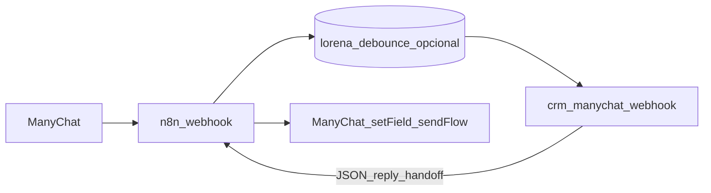

# n8n + CRM: migrar a triagem IA para o Supabase

O export [integrations/n8n/workflows/Instituto_Lorena_Visentainer_FIXED.json](../integrations/n8n/workflows/Instituto_Lorena_Visentainer_FIXED.json) faz hoje:

1. **Webhook** (payload ManyChat: `body.data.id` = subscriber, `body.msg` = texto).
2. **Debounce** em Postgres (`lorena_debounce`) + espera 6s + “sou o último?” — evita disparar a IA a cada tecla.
3. **ManyChat API** `subscriber/getInfo` + código **Montar contexto** (nome, cidade, tags).
4. **AI Agent** (OpenAI `gpt-4o`) + memória `n8n_chat_histories_lorena`.
5. **Detectar intenção** (`[PRONTO_PARA_CONSULTOR]`) → ramos erro / normal / handoff → **setCustomField** + **sendFlow**.

Faz sentido **manter no n8n** o que é orquestração ManyChat (debounce, flows, custom fields) e **mover para o CRM** a IA + histórico comercial + lead Kanban (já exposto em `crm-manychat-webhook`).

## Arquitetura alvo



## 1. System prompt no CRM

Copia o texto longo do **AI Agent** (system message do Instituto Lorena) para o registo **`crm_ai_configs`** (`system_prompt` do id `default`) no Supabase, ou usa `prompt_override` por lead em `crm_conversation_states` quando precisares de exceções.

Assim o modelo passa a ser o configurado no CRM (ex. Z.ai via `crm-ai-assistant`), alinhado ao WhatsApp.

## 2. Substituir “Montar contexto” → HTTP Request (CRM)

Depois do nó **Deletar e recuperar msgs** (ou equivalente com `msg` + `subscriberId` + `fullName`):

- **Método:** `POST`
- **URL:** `https://<PROJECT>.supabase.co/functions/v1/crm-manychat-webhook`
- **Headers:**
  - `Content-Type: application/json`
  - `x-manychat-crm-secret: <MANYCHAT_CRM_SECRET>`

**Body (JSON)** — espelha o que o código “Montar contexto” já produz:

```json
{
  "subscriber_id": "={{ $json.subscriberId }}",
  "user_name": "={{ $json.fullName }}",
  "text": "={{ $json.msg }}",
  "external_message_id": "={{ $execution.id }}",
  "context_append": "={{ $json.userContext }}"
}
```

- `text`: mensagem (ou bloco debounced) do cliente.
- `context_append`: mesmo conteúdo que hoje vai em `userContext` (nome, cidade, tags ManyChat). O CRM junta isto **só** ao pedido à IA; a interação “in” no CRM guarda apenas `text` visível no chat.

**Resposta:**

| Campo | Uso no n8n |
|--------|------------|
| `reply` | Texto limpo para **setCustomField** / mensagem ao utilizador |
| `handoff_suggested` | `true` quando a IA usou a tag `[PRONTO_PARA_CONSULTOR]` (removida do `reply` antes de devolver) — substitui o nó **Detectar intenção** para o ramo consultor |
| `leadId` | Opcional: gravar em custom field ManyChat ou chamar outra tool CRM |

## 3. Nós a desligar / simplificar

- **AI Agent**, **OpenAI Chat Model**, **Postgres Chat Memory** — removidos depois da migração (o histórico de negócio fica em `interactions` + assistente CRM).
- **Detectar intenção** — opcional: podes usar só `{{ $json.handoff_suggested }}` na resposta HTTP (se o n8n parsear o body da última chamada).

## 4. Manter no n8n

- Webhook + debounce (ou migrar debounce para Supabase numa fase 2).
- **Buscar dados do usuário** ManyChat (se quiseres enriquecer `context_append` além do CRM).
- **Salvar resposta** + **sendFlow** (IDs de custom field e `flow_ns` continuam iguais ao fluxo atual).
- **Gerar resumo para consultor** — podes manter ou, noutra fase, gravar `consultorSummary` num campo do lead via novo endpoint ou `crm-ingest-webhook` estendido.

## 5. Contrato completo

Ver também [crm-external-http-api.md](crm-external-http-api.md) (secção `crm-manychat-webhook`).
